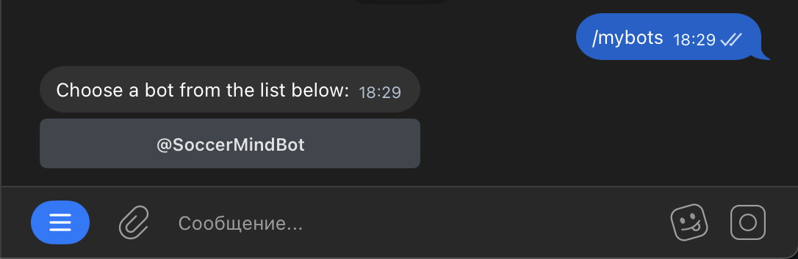
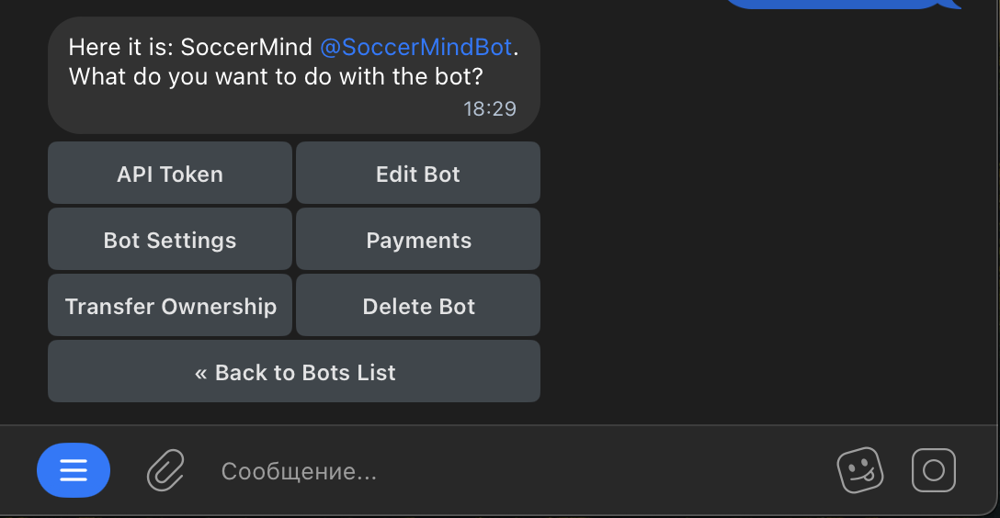
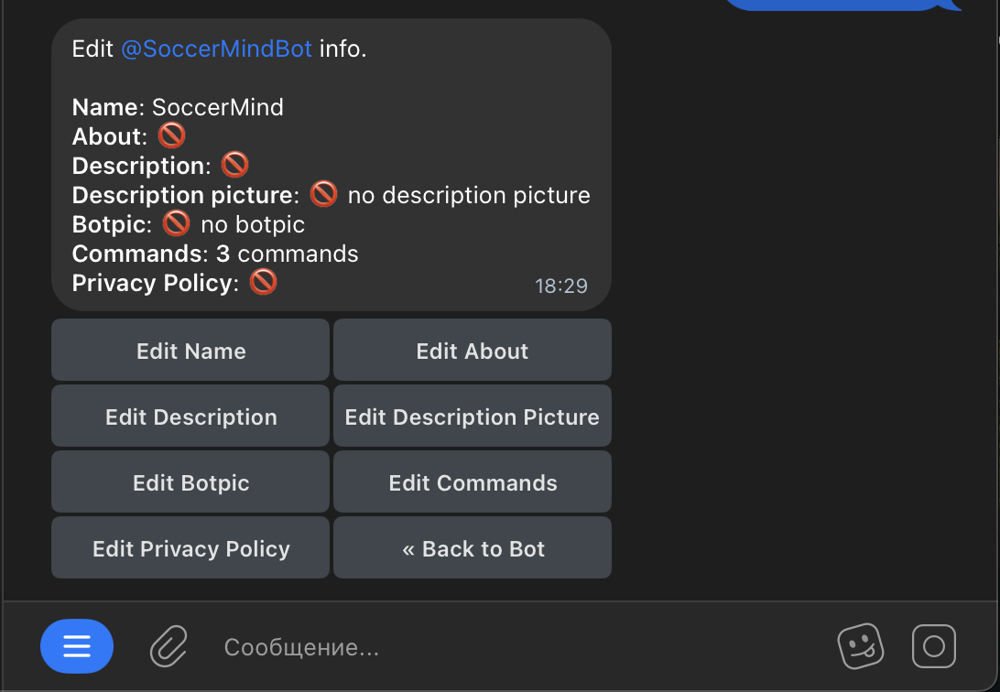
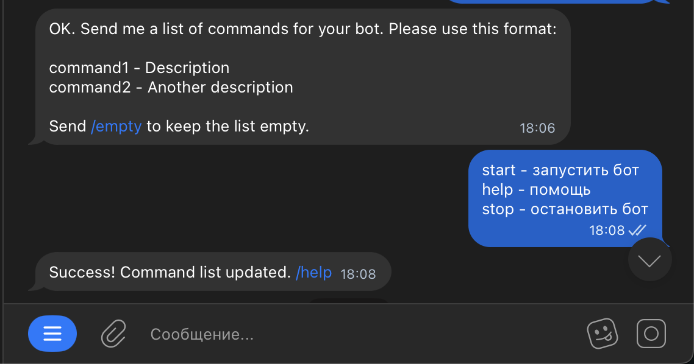
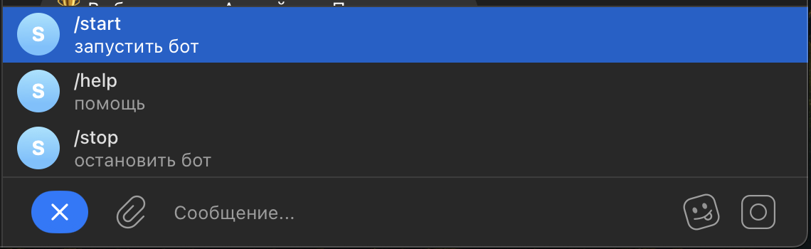
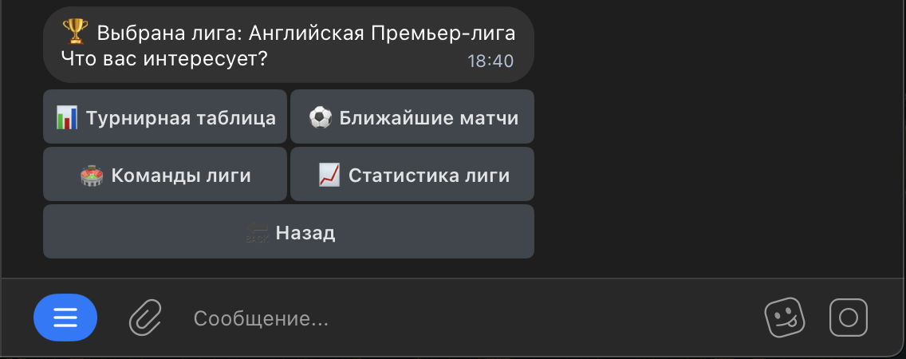
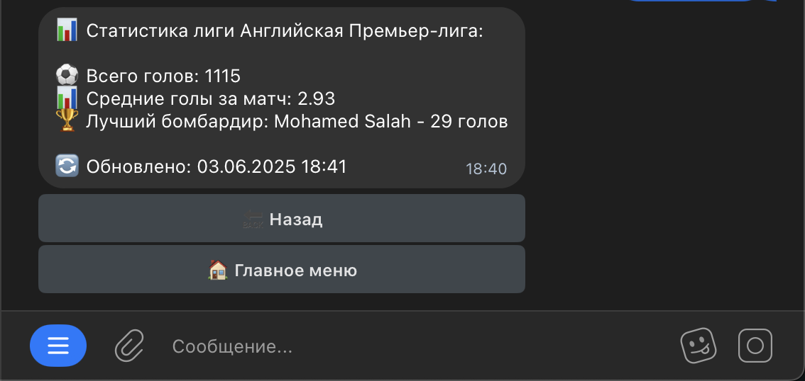

# Модификация Telegram-бота для футбольной статистики
Данный документ описывает процесс модификации существующего Telegram-бота, предназначенного для предоставления футбольной статистики. Цель доработки — расширение функциональности, повышение точности данных и улучшение пользовательского взаимодействия.

## Добавление кнопки меню в телеграмме 
Для бота в Telegram можно настроить отдельную кнопку меню с набором команд или переходом в веб-приложение.
1. Для создания меню запустите в Telegram бота `@BotFather`.
2. Впишите команду `/mybots` и нажмите на бота, для которого хотите настроить меню.

3. В следующем меню нажмите `Edit Bot`.

4. Далее — `Edit Commands`.

5. `@BotFather сообщит`, что ожидает от вас список команд. Ввести их нужно в таком формате:
- command1 — описание
- command2 — еще одно описание

6. Готово! Команды добавлены.


## Добавление статистики чемпионата
Реализоваем функцию, которая показывает основные статистические показатели лиги (голы, владение мячом, удары и т.д.):
```python
# Обработчик статистики лиги
async def handle_stats(update: Update, context: ContextTypes.DEFAULT_TYPE, league_key: str) -> None:
    league_info = LEAGUES[league_key]
    stats = get_league_stats(league_info['id'])

    if stats:
        message = f"📊 Статистика лиги {league_info['name']}:\n\n"
        message += f"⚽ Всего голов: {stats['total_goals']}\n"
        message += f"📊 Средние голы за матч: {stats['avg_goals']}\n"
        message += f"🏆 Лучший бомбардир: {stats['top_scorer']['name']} - {stats['top_scorer']['goals']} голов\n"
        message += "\n🔄 Обновлено: " + datetime.now().strftime("%d.%m.%Y %H:%M")
    else:
        message = "Не удалось получить статистику лиги."

    keyboard = [
        [InlineKeyboardButton("🔙 Назад", callback_data=f"league_{league_key}")],
        [InlineKeyboardButton("🏠 Главное меню", callback_data="main_menu")]
    ]
    reply_markup = InlineKeyboardMarkup(keyboard)
    await update.callback_query.edit_message_text(
        text=message,
        reply_markup=reply_markup
    )

# Получение статистики лиги
def get_league_stats(league_code: str) -> dict:

    matches = make_api_request(f'competitions/{league_code}/matches?status=FINISHED&limit=50')

    scorers = make_api_request(f'competitions/{league_code}/scorers?limit=1')

    if not matches or not scorers:
        return None

    # Считаем основную статистику
    total_goals = sum(m['score']['fullTime']['home'] + m['score']['fullTime']['away'] for m in matches['matches'])
    avg_goals = round(total_goals / len(matches['matches']), 2)

    # Формируем словарь со статистикой
    stats = {
        'total_goals': total_goals,
        'avg_goals': avg_goals,
        'top_scorer': {
            'name': scorers['scorers'][0]['player']['name'],
            'goals': scorers['scorers'][0]['goals']
        },

    }

    return stats

# В обработчике кнопок добавляем новый вариант
async def button(update: Update, context: ContextTypes.DEFAULT_TYPE) -> None:
    query = update.callback_query
    await query.answer()

    if query.data == "main_menu":
        await start(update, context)
    elif query.data == "choose_league":
        await show_leagues(update, context)
    elif query.data == "help":
        await help_command(update, context)
    elif query.data == "stop":
        await stop_command(update, context)
    elif query.data.startswith("league_"):
        league_key = query.data.split("_")[1]
        await handle_league_selection(update, context, league_key)
    elif query.data.startswith("table_"):
        league_key = query.data.split("_")[1]
        await handle_table(update, context, league_key)
    elif query.data.startswith("matches_"):
        league_key = query.data.split("_")[1]
        await handle_matches(update, context, league_key)
    elif query.data.startswith("teams_"):
        league_key = query.data.split("_")[1]
        await handle_teams(update, context, league_key)
    elif query.data.startswith("stats_"):  # Новый обработчик
        league_key = query.data.split("_")[1]
        await handle_stats(update, context, league_key)
    elif query.data == "back":
        await show_leagues(update, context)

# Обновляем обработчик выбора лиги
async def handle_league_selection(update: Update, context: ContextTypes.DEFAULT_TYPE, league_key: str) -> None:

    if league_key not in LEAGUES:
        await update.callback_query.edit_message_text("Ошибка: лига не найдена")
        return

    league_info = LEAGUES[league_key]
    keyboard = [
        [
            InlineKeyboardButton("📊 Турнирная таблица", callback_data=f"table_{league_key}"),
            InlineKeyboardButton("⚽ Ближайшие матчи", callback_data=f"matches_{league_key}"),
        ],
        [
            InlineKeyboardButton("🏟 Команды лиги", callback_data=f"teams_{league_key}"),
            InlineKeyboardButton("📈 Статистика лиги", callback_data=f"stats_{league_key}"),
        ],
        [
            InlineKeyboardButton("🔙 Назад", callback_data="choose_league"),
            InlineKeyboardButton("🏠 Главное меню", callback_data="main_menu")
        ]
    ]
    reply_markup = InlineKeyboardMarkup(keyboard)
    await update.callback_query.edit_message_text(
        text=f"🏆 Выбрана лига: {league_info['name']}\nЧто вас интересует?",
        reply_markup=reply_markup
    )        
```
## Основные изменения
1. Добавлена кнопка "📈 Статистика лиги" в меню выбора лиги
2. Реализована функция handle_stats() для отображения статистики
3. Создана функция get_league_stats() для сбора данных:
    - Общее количество голов
    - Среднее количество голов за матч
    - Лучший бомбардир
4. Добавлен новый обработчик в функцию button() для статистики
5. Улучшено форматирование вывода статистики с эмодзи

### Результат 



