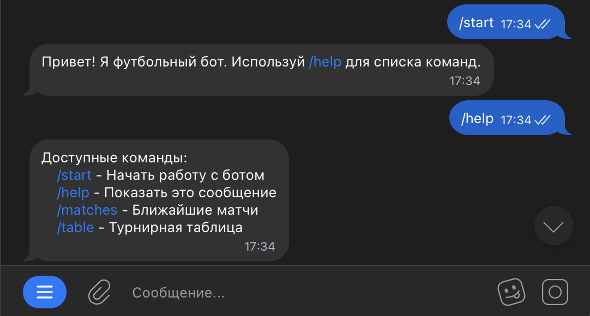
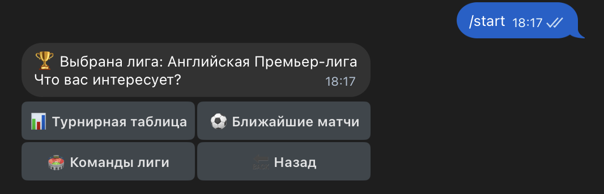
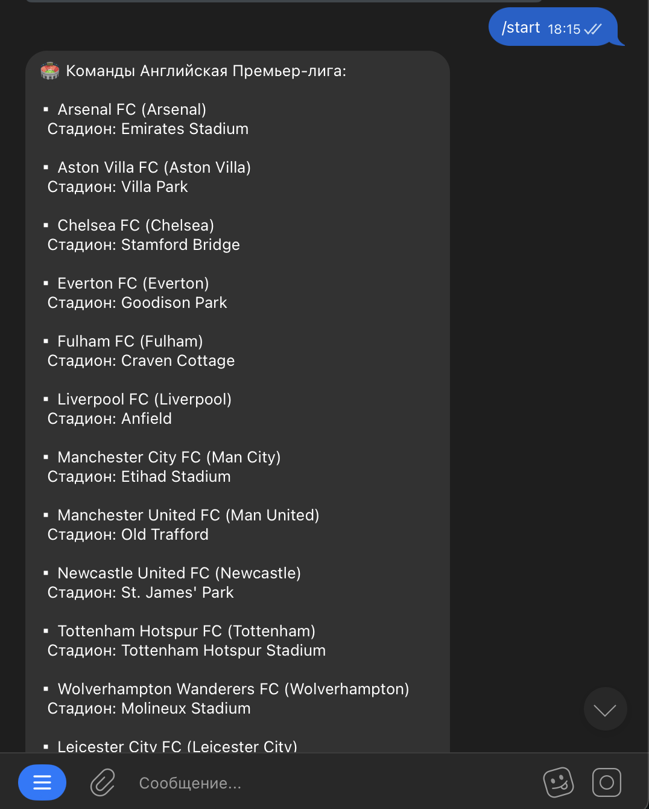

# Техническое руководство по созданию Telegram-бота для футбольной статистики

## Введение
Это руководство описывает процесс создания Telegram-бота для получения футбольной статистики с использованием Python и библиотеки `python-telegram-bot`.

## Предварительные требования
- Python 3.7+
- Учетная запись Telegram
- API-ключ от футбольного API
- Токен Telegram-бота (получается у @BotFather)

## Структура проекта
football_bot/
├── venv              # Виртуального окружение
├── requirements.txt  # Файл с зависимостями
├── .env              # Файл с конфиденциальными данными
└── bot.py            # Основной файл бота

## Настройка окружения
1. Установите Python 3.8+
2. Создайте виртуальное окружение:
```bash
python -m venv football_bot_env
source football_bot_env/bin/activate  # Linux/Mac
football_bot_env\Scripts\activate  # Windows
```
3. Установите необходимые библиотеки
```bash
pip install python-telegram-bot requests python-dotenv

```
4. Переносим зависимости в файл requirements.txt
```bash
pip freeze > requirements.txt

```
## Создание бота в Telegram
1. Откройте Telegram и найдите @BotFather
2. Используйте команду /newbot и следуйте инструкциям
3. Сохраните полученный токен в файле .env

## Конфигурация
### Создайте файл `.env` 
В файле `.env` хранится данные, которые используется для хранения переменных окружения в виде пар ключ=значение. Например:
TELEGRAM_TOKEN=токен телеграмм бота
FOOTBALL_API_KEY=ключ доступа к API
FOOTBALL_API_URL=ссылка на API

## Базовая структура бота
### Создайте файл bot.py с следующим содержимым:
```python
import os
from dotenv import load_dotenv
from telegram import Update
from telegram.ext import Application, CommandHandler, CallbackQueryHandler, ContextTypes, CallbackContext

# Загрузка переменных окружения
load_dotenv()
TOKEN = os.getenv('TELEGRAM_TOKEN')
API_KEY = os.getenv('FOOTBALL_API_KEY')
API_URL = os.getenv('FOOTBALL_API_URL')

async def start(update: Update, context: ContextTypes.DEFAULT_TYPE) -> None:
    await update.message.reply_text('Привет! Я футбольный бот. Используй /help для списка команд.')

async def help_command(update: Update, context: CallbackContext) -> None:
    help_text = """
    Доступные команды:
    /start - Начать работу с ботом
    /help - Показать это сообщение
    /matches - Ближайшие матчи
    /table - Турнирная таблица
    """
    await update.message.reply_text(help_text)

def main() -> None:

    application = Application.builder().token(TOKEN).build()

    application.add_handler(CommandHandler('start', start))
    application.add_handler(CommandHandler('help', help_command))


    application.run_polling()


if __name__ == '__main__':
    main()
```
### Результат

## Добавление футбольного функционала
### Добавим возможность получать информацию о матчах через API Football-Data.org.
1. Создадим словарь с доступными лигами, где ключ - внутренний идентификатор, а значение содержит:
- id - код лиги в API
- name - человекочитаемое название лиги
```python
LEAGUES = {
    'premier': {'id': 'PL', 'name': 'Английская Премьер-лига'},
    'laliga': {'id': 'PD', 'name': 'Ла Лига (Испания)'},
    'seriea': {'id': 'SA', 'name': 'Серия А (Италия)'},
    'bundesliga': {'id': 'BL1', 'name': 'Бундеслига (Германия)'},
    'ligue1': {'id': 'FL1', 'name': 'Лига 1 (Франция)'},
    'rpl': {'id': 'RPL', 'name': 'РПЛ (Россия)'},
}
```
2. Создает главное меню с кнопками для выбора лиги и функцию показа списка лиг. Обрабатывает как команду /start, так и возврат в главное меню.
```python
async def start(update: Update, context: ContextTypes.DEFAULT_TYPE) -> None:
    keyboard = [
        [InlineKeyboardButton(league['name'], callback_data=f"league_{league_key}")]
        for league_key, league in LEAGUES.items()
    ]
    reply_markup = InlineKeyboardMarkup(keyboard)

    if update.message:
        await update.message.reply_text(
            "Добро пожаловать в футбольный бот!\nВыберите действие:",
            reply_markup=reply_markup
        )
    else:
        await update.callback_query.edit_message_text(
            "Добро пожаловать в футбольный бот!\nВыберите действие:",
            reply_markup=reply_markup
        )
async def show_leagues(update: Update, context: ContextTypes.DEFAULT_TYPE) -> None:

    keyboard = [
        [InlineKeyboardButton(league['name'], callback_data=f"league_{league_key}")]
        for league_key, league in LEAGUES.items()
    ]
    keyboard.append([InlineKeyboardButton("🔙 Назад", callback_data="main_menu")])

    reply_markup = InlineKeyboardMarkup(keyboard)
    await update.callback_query.edit_message_text(
        text="Выберите лигу:",
        reply_markup=reply_markup
    )       
```
3. Прописываем работу с выбранной лигой 
```python
Add commentMore actions
async def handle_league_selection(update: Update, context: ContextTypes.DEFAULT_TYPE, league_key: str) -> None:

    if league_key not in LEAGUES:
        await update.callback_query.edit_message_text("Ошибка: лига не найдена")
        return

    league_info = LEAGUES[league_key]
    keyboard = [
        [
            InlineKeyboardButton("📊 Турнирная таблица", callback_data=f"table_{league_key}"),
            InlineKeyboardButton("⚽ Ближайшие матчи", callback_data=f"matches_{league_key}"),
        ],
        [
            InlineKeyboardButton("🏟 Команды лиги", callback_data=f"teams_{league_key}"),
            InlineKeyboardButton("🔙 Назад", callback_data="choose_league"),
        ],

    ]
    reply_markup = InlineKeyboardMarkup(keyboard)
    await update.callback_query.edit_message_text(
        text=f"🏆 Выбрана лига: {league_info['name']}\nЧто вас интересует?",
        reply_markup=reply_markup
    )
```

3. Добавим новые функции, например просмотр турнирной таблицы:
```python
async def handle_matches(update: Update, context: ContextTypes.DEFAULT_TYPE, league_key: str) -> None:

    league_info = LEAGUES[league_key]
    matches = get_upcoming_matches(league_info['id'])

    if matches:
        message = f"⚽ Ближайшие матчи {league_info['name']}:\n\n"
        for match in matches:
            date = datetime.strptime(match['utcDate'], "%Y-%m-%dT%H:%M:%SZ")
            message += (
                f"🕒 {date.strftime('%d.%m %H:%M')} - "
                f"{match['homeTeam']['shortName']} vs {match['awayTeam']['shortName']}\n"
            )
    else:
        message = "Нет запланированных матчей."

    await show_info_with_back_button(update, message, league_key)

```
4. Добавим команду для просмотра турнирной таблицы:
```python
async def handle_table(update: Update, context: ContextTypes.DEFAULT_TYPE, league_key: str) -> None:

    league_info = LEAGUES[league_key]
    table = get_league_table(league_info['id'])

    if table:
        message = f"📊 Турнирная таблица {league_info['name']}:\n\n"
        for team in table:
            message += f"{team['position']}. {team['team']['name']} - {team['points']} очков\n"
        message += "\n🔄 Обновлено: " + datetime.now().strftime("%d.%m.%Y %H:%M")
    else:
        message = "Не удалось получить данные о турнирной таблице."

    await show_info_with_back_button(update, message, league_key)
```
5. Добавим команду для просмотра списка команд:

```python
async def handle_teams(update: Update, context: ContextTypes.DEFAULT_TYPE, league_key: str) -> None:

    league_info = LEAGUES[league_key]
    teams = get_league_teams(league_info['id'])

    if teams:
        message = f"🏟 Команды {league_info['name']}:\n\n"
        for team in teams:
            message += f"▪ {team['name']} ({team['shortName']})\n"
            if 'venue' in team:
                message += f"  Стадион: {team['venue']}\n\n"
    else:
        message = "Не удалось получить список команд."

    await show_info_with_back_button(update, message, league_key)
```
6. Также необходимо получать данные от API:
```python
def make_api_request(endpoint: str):Add commentMore actions
    headers = {'X-Auth-Token': API_KEY}
    try:
        response = requests.get(API_URL + endpoint, headers=headers)
        if response.status_code == 200:
            return response.json()
        logger.error(f"API Error: {response.status_code} - {response.text}")
        return None
    except Exception as e:
        logger.error(f"Request Error: {e}")
        return None


def get_league_table(league_code: str) -> list:
    data = make_api_request(f'competitions/{league_code}/standings')
    if data and 'standings' in data:
        for standing in data['standings']:
            if standing['type'] == 'TOTAL':
                return standing['table']
    return None


def get_upcoming_matches(league_code: str) -> list:
    data = make_api_request(f'competitions/{league_code}/matches?status=SCHEDULED')
    if data and 'matches' in data:
        return data['matches']
    return None


def get_league_teams(league_code: str) -> list:
    data = make_api_request(f'competitions/{league_code}/teams')
    if data and 'teams' in data:
        return data['teams']
    return None
```
7. Обработка нажатий кнопок. Центральный обработчик всех callback-запросов от кнопок. В зависимости от значения callback_data вызывает соответствующую функцию:
```python
async def button(update: Update, context: ContextTypes.DEFAULT_TYPE) -> None:

    query = update.callback_query
    await query.answer()

    if query.data == "main_menu":
        await start(update, context)
    elif query.data == "choose_league":
        await show_leagues(update, context)
    elif query.data == "help":
        await help_command(update, context)
    elif query.data == "stop":
        await stop_command(update, context)
    elif query.data.startswith("league_"):
        league_key = query.data.split("_")[1]
        await handle_league_selection(update, context, league_key)
    elif query.data.startswith("table_"):
        league_key = query.data.split("_")[1]
        await handle_table(update, context, league_key)
    elif query.data.startswith("matches_"):
        league_key = query.data.split("_")[1]
        await handle_matches(update, context, league_key)
    elif query.data.startswith("teams_"):
        league_key = query.data.split("_")[1]
        await handle_teams(update, context, league_key)
    elif query.data == "back":
        await show_leagues(update, context)
```

8. Дописываем настройки логирования, команды /help и /stop
```python
logging.basicConfig(
    format='%(asctime)s - %(name)s - %(levelname)s - %(message)s',
    level=logging.INFO
)Add commentMore actions
logger = logging.getLogger(__name__)

async def help_command(update: Update, context: ContextTypes.DEFAULT_TYPE) -> None:Add commentMore actions

    help_text = """
*Футбольный бот* поможет вам следить за футбольными лигами

*Основные команды:*
/start - Главное меню
/help - Эта справка
/stop - Остановить бота

*Возможности:*
- Просмотр турнирных таблиц
- Ближайшие матчи
- Список команд в лигах

"""
    keyboard = [[InlineKeyboardButton("🔙 Назад", callback_data="main_menu")]]
    reply_markup = InlineKeyboardMarkup(keyboard)

    if update.message:
        await update.message.reply_text(help_text, parse_mode='Markdown', reply_markup=reply_markup)
    else:
        await update.callback_query.edit_message_text(help_text, parse_mode='Markdown', reply_markup=reply_markup)


async def stop_command(update: Update, context: ContextTypes.DEFAULT_TYPE) -> None:

    stop_text = """
Бот остановлен. Все ваши данные удалены.

Если захотите снова воспользоваться ботом, просто отправьте /start
"""
    keyboard = [[InlineKeyboardButton("🔄 Перезапустить", callback_data="main_menu")]]
    reply_markup = InlineKeyboardMarkup(keyboard)

    if update.message:
        await update.message.reply_text(stop_text, reply_markup=reply_markup)
    else:
        await update.callback_query.edit_message_text(stop_text, reply_markup=reply_markup)

```

## Развертывание
1. Установте зависимости
```bash
pip install -r requirements.txt

```
2. Запустите бота
```bash
python bot.py

```
3. Проверьте работу




